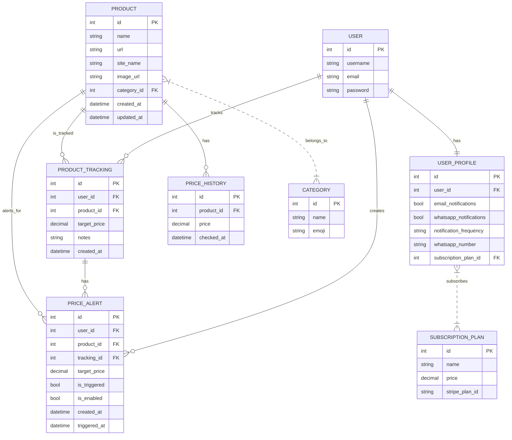

# Deal Radar

**Never Miss a Deal Again!**  
Deal Radar is a robust Django-based web application that empowers users to track product prices across major e-commerce platforms and receive real-time alerts when deals are available. With a modern, responsive interface and automated background processing, Deal Radar ensures you never miss a price drop on your favorite products.

---

## Table of Contents

- [Live Demo](#live-demo)
- [Screenshots](#screenshots)
- [ERD (Entity Relationship Diagram)](#erd-entity-relationship-diagram)
- [Tech Stack](#tech-stack)
- [Libraries & Tools](#libraries--tools)
- [External APIs & Integrations](#external-apis--integrations)
- [Features](#features)
- [Project Structure](#project-structure)
- [Setup & Installation](#setup--installation)
- [Future Enhancements](#future-enhancements)
- [License](#license)
- [Contact](#contact)

---

## Live Demo

- [Live Site](https://your-dealradar-demo-link.com)
- [Admin Panel](https://your-dealradar-demo-link.com/admin)

---

## Screenshots

| Home Page (Responsive) | SEO & Accessibility | Performance (Lighthouse) |
|------------------------|---------------------|--------------------------|
|  |  |  |

---

## ERD (Entity Relationship Diagram)



---

## Tech Stack

- **Backend:** Django, Python 3
- **Frontend:** HTML5, CSS3, Bootstrap 5, JavaScript (ES6)
- **Database:** SQLite (development), PostgreSQL (production-ready)
- **Cloud Storage:** Cloudinary (for product images)
- **Task Queue:** Celery, Redis

---

## Libraries & Tools

- Django (core framework)
- Stripe (subscription & payment integration)
- Cloudinary (image hosting)
- Bootstrap (UI framework)
- FontAwesome (icons)
- Requests (web scraping)
- BeautifulSoup (web scraping)
- Celery (background tasks, optional)
- Redis (task/message broker, optional)
- gunicorn (production server)
- whitenoise (static files in production)
- pytest (testing)
- dotenv (environment variables)
- Git (version control)
- GitHub Actions (CI/CD)

---

## External APIs & Integrations

- Stripe API: For subscription management, billing, and webhooks.
- Cloudinary API: For image upload and delivery.
- WhatsApp API (Twilio or similar): For WhatsApp notifications (if enabled).
- Email Providers: SMTP (Gmail, SendGrid, etc.) for email notifications.

---

## Features

- Product Search: Search and filter products from multiple e-commerce sites.
- Product Tracking: Track price changes and get notified.
- Price Alerts: Set target prices and receive alerts via email/WhatsApp.
- User Profiles: Manage personal info, notification preferences, and tracked products.
- Subscription Plans: Free, Basic, and Premium plans with Stripe integration.
- Billing Management: Upgrade/downgrade plans, manage billing via Stripe portal.
- Responsive Design: Fully responsive for mobile, tablet, and desktop.
- SEO Optimized: Meta tags, semantic HTML, and fast load times.
- Admin Panel: Manage products, users, and site content.
- Supported Sites: Amazon, eBay, Argos, Currys, John Lewis, Nike, Costco, TheWorks, JDSports, Appliance City, Next, and more.
- Security: CSRF protection, secure authentication, and environment variable management.

---

## Project Structure

```
deal_radar/
├── products/                # Django app for product logic
├── templates/               # HTML templates
│   ├── products/
│   ├── subscriptions/
│   └── supported_sites.html
├── static/                  # Static files (CSS, JS, images)
├── media/                   # Uploaded media (Cloudinary)
├── manage.py
└── deal_radar/              # Project settings
```

---

## Setup & Installation

1. **Clone the repo:**
   ```sh
   git clone https://github.com/yourusername/deal-radar.git
   cd deal-radar
   ```

2. **Create a virtual environment and install dependencies:**
   ```sh
   python -m venv venv
   source venv/bin/activate  # or venv\Scripts\activate on Windows
   pip install -r requirements.txt
   ```

3. **Set up environment variables:**
   - Copy `.env.example` to `.env` and fill in your keys (Stripe, Cloudinary, etc.)

4. **Run migrations and start the server:**
   ```sh
   python manage.py migrate
   python manage.py runserver
   ```

5. **Access the app:**
   - Visit [https://my-dealradar-app-61098a40edc6.herokuapp.com/](https://my-dealradar-app-61098a40edc6.herokuapp.com/)

---

## Future Enhancements

- Browser Extension:  
  Allow users to add products to Deal Radar directly from supported e-commerce sites via a Chrome/Firefox extension.

- Mobile App:  
  Native iOS and Android apps for on-the-go deal tracking and notifications.

- Social Sharing:  
  Enable users to share deals or tracked products on social media platforms.

- Deal Community & Comments:  
  Add a community section for users to discuss deals, leave reviews, and comment on products.

- Personalized Recommendations:  
  Suggest products or deals based on user preferences and tracking history.

- Advanced Analytics Dashboard:  
  Visualize price trends, savings, and user activity with charts and graphs.

- Bulk Product Import:  
  Allow users to import a list of products (CSV/Excel) for bulk tracking.

- Multi-Currency & Localization:  
  Support for multiple currencies and languages for international users.

- Push Notifications:  
  Real-time browser and mobile push notifications for instant deal alerts.

- Wishlist Integration:  
  Sync with users’ wishlists from Amazon, eBay, etc., for automatic tracking.

- Affiliate Link Support:  
  Integrate affiliate links to monetize tracked deals.

- AI-Powered Deal Insights:  
  Use AI to predict future price drops or recommend the best time to buy.

- Price Comparison Engine:  
  Compare prices for the same product across all supported sites in real time.

- User Badges & Gamification:  
  Reward active users with badges, leaderboards, or points for engagement.

- Dark Mode:  
  Add a toggle for dark/light theme support.

- API for Developers:  
  Public API for third-party integrations and custom apps.

---

## License

This project is licensed under the [MIT License](LICENSE).

---

## Contact

- Project Maintainer: [Sandhya Harshakumar](mailto: sandhyaharsh@gmail.com)
- GitHub: [Sandhya80](https://github.com/Sandhya80)
- LinkedIn: [Sandhya Harshakumar](www.linkedin.com/in/sandhya-harshakumar)