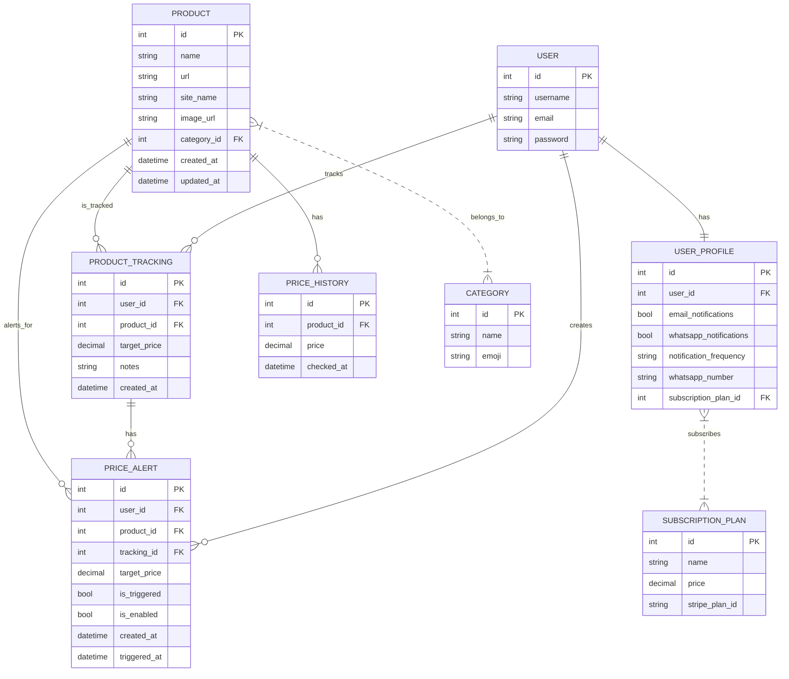

# Deal Radar

**Never Miss a Deal Again!**  
Deal Radar is a robust Django-based web application that empowers users to track product prices across major e-commerce platforms and receive real-time alerts when deals are available. With a modern, responsive interface and automated background processing, Deal Radar ensures you never miss a price drop on your favorite products.

---

## 🔄 App Workflow Overview

1. **Add Products to Track:**  
   Add products by pasting a URL from a supported e-commerce site or by selecting from existing products in the database.

2. **Set Target Price:**  
   Specify a target price for each product. You’ll be notified when the product reaches or drops below this price.

3. **Automated Price Tracking:**  
   The system regularly scrapes product pages using background Celery tasks to check for price changes.

4. **Receive Alerts:**  
   When a product’s price drops to or below your target, Deal Radar sends real-time alerts via email, WhatsApp, or SMS (based on your preferences).

5. **Dashboard & Management:**  
   View all tracked products, manage alerts, and see your savings and triggered alerts on a personalized dashboard.

6. **Subscription & Billing:**  
   Unlock premium features (like more frequent checks or additional notification channels) via Stripe-powered subscriptions.

---

## 🚦 Project Status

- **Phase 1: Foundation & Authentication** ✅ Complete  
- **Phase 2: MVP Functionality** ✅ Complete  
- **Phase 3: Automation & Alerts** ✅ Complete  
- **Phase 4: Polish & Monetization** ✅ Complete  

---

## ✅ Completed Features by Phase

### Phase 1: Foundation & Authentication

- Modular Django apps: `users`, `products`, `notifications`, `subscriptions`
- Comprehensive code documentation and comments
- Dependency management (`requirements.txt`, `.env.example`, `.gitignore`)
- Database models for users, products, price history, and alerts
- User authentication (registration, login, logout) with Django AllAuth
- Profile management with notification preferences and subscription tiers
- Responsive Bootstrap 5 UI with base, dashboard, and CRUD templates

### Phase 2: MVP Functionality

- Automated web scraping for supported e-commerce sites (Amazon, eBay, Argos, etc.)
- Celery background task system for scheduled scraping and notifications
- Redis integration for task queue management
- Enhanced dashboard with real-time scraping status and product updates
- Admin tools for manual scraping and product management
- Product search, category browsing, and filtering

### Phase 3: Automation & Alerts

- Email notifications for price drops and triggered alerts
- SMS/WhatsApp integration via Twilio for instant alerts
- Celery task scheduling for periodic scraping and alert delivery
- User-configurable alert preferences (frequency, channels)
- Daily/weekly summary emails for tracked products and triggered alerts

### Phase 4: Polish & Monetization

- Stripe subscription system for premium features
- Billing management and upgrade/downgrade flows
- Unit and integration testing for core features
- Security hardening (environment variables, HTTPS, input validation)
- Final deployment to Heroku (or similar cloud platform)
- Cloudinary integration for product image storage
- UI/UX polish and accessibility improvements

---

## 🚀 Getting Started

### 1. Install Dependencies & Setup Environment

```bash
# Create virtual environment
python -m venv deal_radar_env
deal_radar_env\Scripts\activate  # Windows

# Install dependencies
pip install -r requirements.txt

# Setup environment
copy .env.example .env
# Edit .env with your database and API credentials
```

### 2. Database Setup

```bash
# Create and run migrations
python manage.py makemigrations
python manage.py migrate

# Create superuser
python manage.py createsuperuser
```

### 3. Run Development Server

```bash
python manage.py runserver
```

### 4. Start Celery Worker (for background tasks)

```bash
celery -A deal_radar worker -l info
celery -A deal_radar beat -l info
```

### 5. (Optional) Start Redis Server

- Ensure Redis is running for Celery task queue.

---

## 🐞 Debugging Methods Used

- **Django Debug Toolbar**: For inspecting SQL queries, cache usage, and template context.
- **Python Logging**: Configured in `settings.py` for error, warning, and info logs.
- **Custom Error Pages**: User-friendly error templates for 404/500.
- **Unit Tests**: Django’s test framework for core logic and integration.
- **Manual Testing**: Django shell (`python manage.py shell`) and admin panel for data validation.
- **Celery Task Monitoring**: Celery logs and Flower (optional) for background task debugging.
- **AI Assistance**: GitHub Copilot for code review, suggestions, and troubleshooting.

---

## 🗄️ Database Schema

Below is a simplified schema of the main tables and relationships in Deal Radar:



---

## 🏗️ Architecture Overview

```
Frontend (Bootstrap + Django Templates)
    ↕
Django Views + Django REST Framework
    ↕
PostgreSQL (Users, Products, Price History)
    ↕
Celery Workers (Price Scraping, Alerts)
    ↕
Redis (Task Queue)
    ↕
Notifications (Email/SMS/WhatsApp)
    ↕
Stripe (Billing)
    ↕
Cloudinary (Image Storage)
```

---

## ✨ Features Overview

### Phase 1: Foundation
- [x] User authentication system (register, login, logout)
- [x] Product tracking models and price history
- [x] Basic dashboard UI and CRUD for products
- [x] Responsive Bootstrap UI

### Phase 2: MVP Functionality
- [x] Web scraping for supported sites
- [x] Price drop detection and history
- [x] Dashboard with real data and search/filter
- [x] Admin tools for scraping and product management

### Phase 3: Automation & Alerts
- [x] Email and WhatsApp/SMS notifications
- [x] Celery task scheduling for scraping and alerts
- [x] User alert preferences (frequency, channels)
- [x] Daily/weekly summary emails

### Phase 4: Polish & Monetization
- [x] Stripe subscription system (Free/Basic/Premium)
- [x] Billing management and upgrade/downgrade
- [x] Unit and integration testing
- [x] Security hardening and accessibility
- [x] Final deployment and documentation

---

## 🛠️ Tech Stack

- **Backend**: Django 5.0, Django REST Framework
- **Database**: PostgreSQL, Heroku Postgres
- **Frontend**: Bootstrap 5, HTML5, CSS3, JavaScript
- **Task Queue**: Celery + Redis
- **Scraping**: BeautifulSoup
- **Notifications**: Twilio (SMS/WhatsApp), SMIP (Email)
- **Payments**: Stripe
- **Deployment**: Heroku with GitHub integration
- **Storage**: Cloudinary (for images)

---

## 📋 Assessment Criteria Alignment

- **Authentication & Role-Based Access**: Django Auth + User Profiles
- **Database Design & CRUD**: PostgreSQL + Django ORM
- **Front-End Design & UX**: Bootstrap + Responsive Design
- **Version Control**: Git + GitHub
- **Deployment**: Heroku Ready
- **Custom Data Modeling**: Product/Price/User Models
- **Security**: Environment Variables + HTTPS

---

## 🤝 Support

For questions or issues, please create an issue in this repository.

---

**Built with Django, Celery, Stripe, and AI assistance for debugging**
